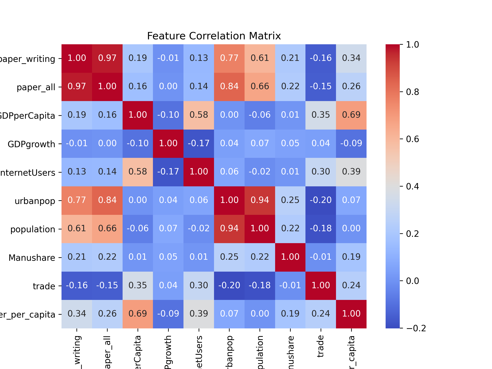
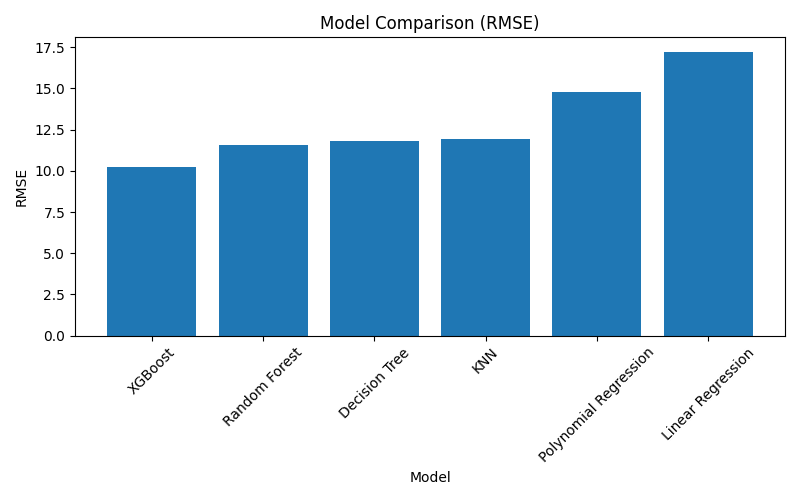
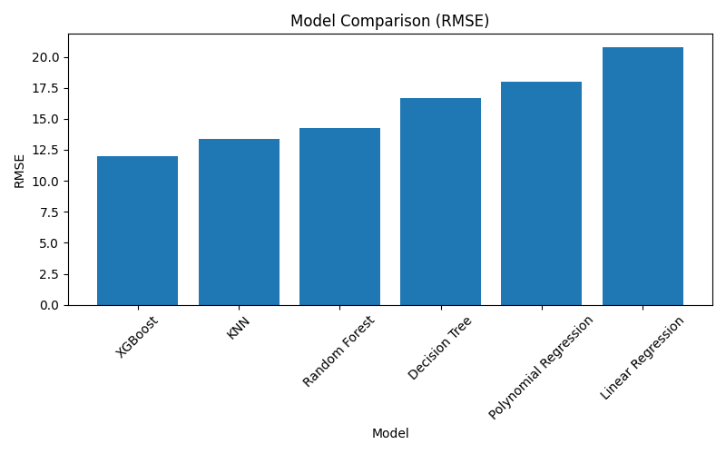
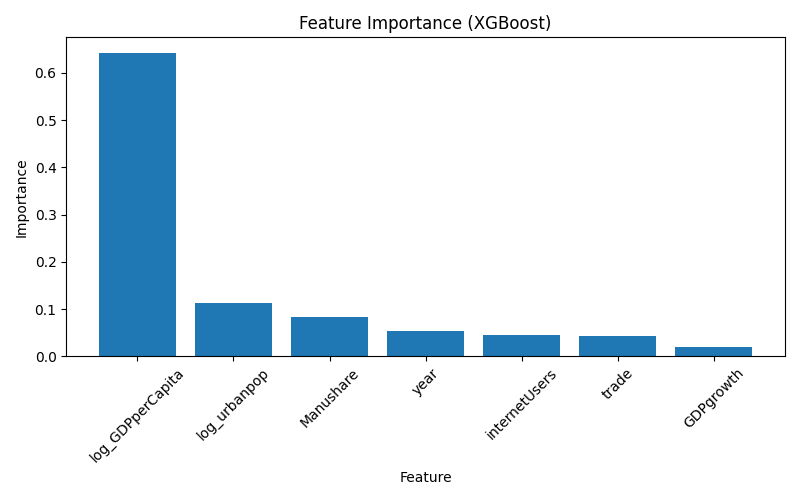
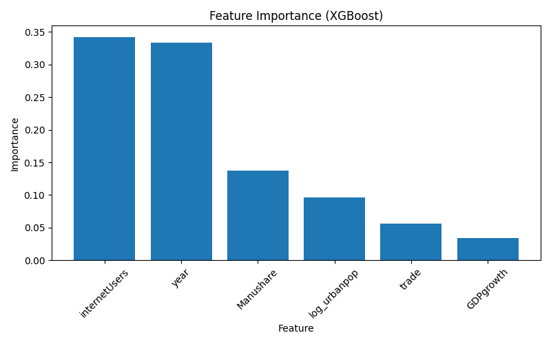

# eco395m-MidtermProject
Group Member: Mingqian Gao, Yuxin Zhao, and Chieh Su

Mingqian Gao: Data cleaning and merging, descriptive statistics and correlation analysis;
Yuxin Zhao
Chieh Su

## 1. Introduction

Over the past few decades, rapid advances in digital technology have transformed how information is produced, stored, and transmitted. The widespread adoption of the internet, electronic documents, and online communication has led many observers to predict the emergence of a “paperless society.” Under this hypothesis, increasing digitalization may reduce the demand for traditional printing and writing paper.

However, the relationship between digitalization and paper consumption is complex. While electronic communication may substitute for printed materials, economic development and expanding commercial activities may also increase the demand for paper products. As a result, it is not immediately clear whether digitalization actually reduces paper consumption across countries.

In this project, we examine whether economic and digital development indicators can predict cross-country differences in printing and writing paper consumption. Using country-level panel data from the Food and Agriculture Organization and the World Bank, we analyze how variables such as GDP, internet adoption, urbanization, and industrial structure are associated with printing and writing paper consumption. We compare several predictive models to evaluate which factors best explain variation in paper demand.

## 2. Data

### 2.1 Data Sources

This study combines multiple international datasets to construct a country–year panel dataset.  

Economic indicators, including GDP per capita, GDP growth, manufacturing share, trade openness, internet usage, urban population, and total population, are obtained from the World Bank's World Development Indicators (WDI).  

Data on paper production, imports, and exports are obtained from FAOSTAT. These data are used to construct measures of paper consumption. Writing and printing paper consumption is calculated as production plus imports minus exports. Total paper consumption is constructed using the same accounting identity.

The final dataset covers 114 countries over the period from 1990 to 2024. Because data availability varies across countries and indicators, the panel is not perfectly balanced.  However, the majority of countries maintain relatively complete time coverage. Only 18 countries have fewer than 15 years of observations, while most countries contribute substantially longer time series.

---

### 2.2 Variable Construction

The main outcome variable is **writing and printing paper consumption per capita**, measured in kilograms per person. It is calculated by dividing national paper consumption by total population.

Key explanatory variables capture economic development, technological adoption, and economic structure. These include GDP per capita (constant 2015 USD), GDP growth rate, internet users as a share of population, urban population, manufacturing value added as a share of GDP, and trade openness measured as the ratio of trade to GDP.

Several variables are transformed or standardized to ensure comparability across countries. For example, manufacturing share and trade openness are expressed as proportions, and paper consumption is converted from tons to kilograms when constructing per capita measures.

<p align="center"><strong>Table 1. Variable Definitions</strong></p>

| Variable | Description | Unit |
|---|---|---|
| Paper Consumption per Capita | Writing and printing paper consumption per capita, calculated as national paper consumption divided by total population | kilograms/person |
| Paper Writing Consumption | Total national consumption of writing and printing paper, calculated as production plus imports minus exports | kilograms |
| Total Paper Consumption | Total national consumption of all paper products, calculated as production plus imports minus exports | kilograms |
| GDP per Capita | Gross domestic product per capita, measured in constant 2015 USD | USD |
| GDP Growth | Annual growth rate of GDP | percent |
| Internet Users | Individuals using the internet as a share of the population | percent |
| Urban Population | Total population living in urban areas | persons |
| Total Population | Total national population | persons |
| Manufacturing Share | Manufacturing value added as a share of GDP | proportion |
| Trade Openness | Total trade (exports + imports) as a share of GDP | proportion |

### 2.3 Descriptive Statistics

Table 2 reports summary statistics for the main variables used in the analysis.  
The final panel dataset contains **5,373 country–year observations** covering multiple countries over time.

Paper consumption per capita exhibits a highly right-skewed distribution, with most observations concentrated at relatively low levels but a small number of extreme values.

The statistics also indicate substantial heterogeneity in economic development, technological adoption, and economic structure across the sample. 
Variables such as GDP per capita, internet penetration, and trade openness display wide variation, reflecting differences in development levels and economic characteristics across countries and over time.

---

<p align="center"><strong> Table 2: Summary Statistics</strong></p>

| Variable | Count | Mean | Std. Dev. | Min | 25% | Median | 75% | Max |
|---|---|---|---|---|---|---|---|---|
| Paper Writing Consumption | 5373 | 586,248,428 | 2,472,254,841 | 0 | 2,956,000 | 26,700,000 | 237,800,000 | 2.817e10 |
| Total Paper Consumption | 4979 | 2,187,939,747 | 9,787,037,339 | 0 | 8,780,000 | 92,219,000 | 804,950,000 | 1.423e11 |
| GDP per Capita (USD) | 5373 | 13,159.81 | 17,802.52 | 170.23 | 1,774.64 | 5,175.20 | 17,980.73 | 167,187.16 |
| GDP Growth (%) | 5365 | 3.54 | 5.99 | -51.03 | 1.41 | 3.69 | 5.90 | 149.97 |
| Internet Users (% of population) | 5373 | 31.79 | 32.40 | 0 | 1.86 | 18.90 | 61.16 | 100 |
| Urban Population | 5373 | 20,412,950 | 64,241,165 | 4,344 | 1,263,587 | 4,262,417 | 14,315,364 | 928,439,823 |
| Total Population | 5373 | 392,414,999 | 1,402,894,242 | 9,544 | 2,392,978 | 8,472,313 | 27,154,515 | 1.425e9 |
| Manufacturing Share | 4810 | 0.126 | 0.064 | 0.003 | 0.079 | 0.123 | 0.167 | 0.450 |
| Trade Openness | 4739 | 0.850 | 0.530 | 0.100 | 0.515 | 0.731 | 1.025 | 1.426 |
| Paper Consumption per Capita | 5373 | 14.40 | 26.72 | 0 | 0.79 | 4.29 | 14.96 | 782.93 |

---

### 2.4 Correlation Analysis

To explore the relationships among the main variables, Figure 1 presents the correlation matrix of key variables in the dataset. The heatmap visualizes pairwise Pearson correlation coefficients, with warmer colors indicating stronger positive correlations and cooler colors indicating negative correlations.

Several patterns emerge from the figure. First, total paper consumption and writing paper consumption are highly correlated, reflecting that writing and printing paper represents a large share of overall paper usage. Second, urban population and total population exhibit a strong positive correlation, which is expected since more populous countries tend to have larger urban populations.

In terms of economic development, GDP per capita is positively correlated with internet penetration and paper consumption per capita, suggesting that more developed economies tend to have higher levels of digital adoption as well as higher consumption of paper products.

Interestingly, trade openness shows a weak negative correlation with paper consumption variables, while manufacturing share displays only modest correlations with most variables. Overall, the correlation patterns suggest that economic development, urbanization, and digital adoption may play an important role in shaping paper consumption patterns across countries.

<p align="center">
<br>
<b>Figure 1. Correlation matrix of key variables.</b>
</p>

## 3. Models

### 3.1 Modeling Approaches

To examine the relationship between economic indicators and paper consumption, we implemented several predictive models and compared their performance. The dependent variable in the analysis is the **logarithm of paper consumption per capita**, which was constructed by dividing writing paper consumption by population and applying a log transformation. The log transformation helps reduce skewness in the distribution and improves model stability.

We first implemented **Linear Regression** as a baseline model. This model assumes a linear relationship between the explanatory variables and paper consumption per capita, providing a benchmark against which more flexible machine learning models can be compared.

To capture potential nonlinear effects, we also implemented **Polynomial Regression** with second-degree polynomial features. This specification allows the model to capture both **nonlinear relationships** (through squared terms) and **interaction effects between explanatory variables**. As a result, the model can represent curved relationships and potential interactions among economic indicators while maintaining relatively simple interpretability.

In addition, we applied several machine learning models capable of capturing complex nonlinear patterns in the data. A **K-Nearest Neighbors (KNN)** regression model predicts outcomes based on the average behavior of nearby observations in the feature space. A **Decision Tree Regressor** was also implemented, which models nonlinear relationships by recursively splitting the data based on feature values.

To further improve predictive performance, we used two ensemble learning methods. **Random Forest** aggregates predictions from many decision trees trained on different bootstrap samples of the data, reducing variance and improving model stability. **XGBoost**, a gradient boosting algorithm, sequentially builds trees that focus on correcting prediction errors from previous trees, enabling the model to capture complex interactions among features.

For each model, hyperparameters were selected using **GridSearchCV with cross-validation**, where the goal was to minimize the **Root Mean Squared Error (RMSE)**. The tuned models were then evaluated on the test dataset to compare their predictive performance.

### 3.2 Model Limitations

Despite using multiple modeling approaches, several limitations remain in this analysis.

First, although the dataset contains several thousand observations, the **number of features included in the models is relatively limited**. Paper consumption is likely influenced by additional factors not included in the dataset, such as environmental regulations, digitalization trends, technological adoption, industrial structure changes, and shifts in consumer behavior. The absence of these variables may reduce the predictive power of the models and limit their ability to fully capture the determinants of paper consumption.

Second, the analysis relies on **aggregated country-level macroeconomic data**, which may mask substantial heterogeneity within countries. Differences across regions, industries, or demographic groups are not captured in the dataset, potentially limiting the precision of the predictions.

Third, the models used in this project focus on **prediction rather than causal inference**. While machine learning models can identify statistical relationships between the input features and paper consumption, they do not establish causal effects. Therefore, the results should be interpreted as predictive associations rather than evidence of causal relationships.

Finally, the models rely on historical data and implicitly assume that the relationships between predictors and paper consumption remain relatively stable over time. However, structural changes such as technological innovation, policy changes, or shifts in global trade patterns may alter these relationships, potentially reducing the reliability of the models for long-term forecasting.

### 3.3 Model Comparison and Recommendation

To evaluate which model performs best in predicting paper consumption across countries, we compared several machine learning models including Linear Regression, Polynomial Regression, KNN, Decision Tree, Random Forest, and XGBoost. 

Model performance is evaluated using **RMSE (Root Mean Squared Error)** and **R²** on the test dataset. Lower RMSE indicates better predictive performance.

We conducted two sets of experiments:

1. Models **including GDP per capita**
2. Models **excluding GDP per capita**

This allows us to evaluate how important GDP per capita is in predicting paper consumption.

## 3.3.1 Model Comparison (With GDP per capita)

The model comparison results with GDP per capita included are saved in: output/model_comparison_with_gdp.csv

---

<div align="center">

<strong>Table 3. Model comparison with GDP</strong>

| Model | RMSE | R² |
|:----:|:----:|:----:|
| XGBoost | 10.26 | 0.842 |
| Random Forest | 11.56 | 0.799 |
| Decision Tree | 11.79 | 0.791 |
| KNN | 11.92 | 0.786 |
| Polynomial Regression | 14.79 | 0.671 |
| Linear Regression | 17.24 | 0.553 |

</div>
The visualization of model performance is shown below:

<p align="center">
<br>
<b>Figure 2. model comparison with GDP per capita.</b>
</p>

From the RMSE comparison, **XGBoost performs the best** with the lowest prediction error.


## 3.3.2 Model Comparison (Without GDP per capita)

To test whether other variables alone can predict paper consumption, we also trained models **without GDP per capita**.

The results are stored in: 'output/model_comparison_without_gdp.csv'

<div align="center">
 <strong>Table 4. Model comparison without gdp</strong>

| Model | RMSE | R² |
|:----:|:----:|:----:|
| XGBoost | 12.02 | 0.783 |
| KNN | 13.37 | 0.731 |
| Random Forest | 14.22 | 0.696 |
| Decision Tree | 16.68 | 0.582 |
| Polynomial Regression | 17.99 | 0.514 |
| Linear Regression | 20.81 | 0.349 |
</div>

Visualization:

<p align="center">
<br>
<b>Figure 3. model comparison without GDP per capita.</b>
</p>

After removing GDP per capita, model performance declines across all models. RMSE increases and R² decreases, indicating that GDP per capita is an important predictor of paper consumption.


## 3.3.3 Feature Importance Analysis

Feature importance is calculated using the **XGBoost model**, which achieved the best performance.

### Feature importance (with GDP per capita)

<p align="center">
<br>
<b>Figure 4. Feature importance with GDP per capita.</b>
</p>

The results show that **log GDP per capita is the most important feature**, contributing more than 60% of the importance in the model.


### Feature importance (without GDP per capita)

<p align="center">
<br>
<b>Figure 5. Feature importance without GDP per capita.</b>
</p>

When GDP per capita is removed, other variables such as **internet users, year, and manufacturing share** become more important. However, these variables together still cannot fully replace the predictive power of GDP per capita.


## 3.3.4 Recommendation

Based on the model comparison results, **XGBoost is the recommended model for predicting paper consumption across countries.**

There are two main reasons:

1. XGBoost consistently achieves the lowest RMSE and highest R² among all tested models.

2. Compared with linear models, XGBoost can capture more complex relationships between economic indicators and paper consumption.

In addition, the feature importance analysis suggests that GDP per capita is the most influential factor affecting paper consumption. Countries with higher levels of economic development tend to consume more paper products.

Therefore, our final recommendation is to **use XGBoost with GDP per capita included as the main model for predicting paper consumption across countries.**

## 4. Interpretation

One interesting result appears when we compare the feature importance before and after removing GDP per capita.

When GDP per capita is included in the model, it dominates the feature importance ranking. The variable **log_GDPperCapita** accounts for the majority of the predictive power in the XGBoost model. In this case, other variables such as internet usage, urban population, and manufacturing share play relatively smaller roles.

However, when GDP per capita is removed from the model, the importance ranking changes significantly. In this case, **internetUsers becomes the most important predictor** of paper consumption. Other variables such as year and manufacturing share also gain relatively higher importance.

This shift is meaningful because **internetUsers can be interpreted as a proxy for digital development and technological adoption**.

In other words, once the model can no longer rely on GDP per capita to capture overall economic development, it begins to rely more heavily on variables that reflect the **digital environment of a country**.

This result connects directly to the motivation of our project. At the beginning of this project, we were interested in understanding how **technological progress and digitalization might influence paper consumption**. One common argument is that as digital technology becomes more widespread, the demand for paper may change due to digital communication, online documents, and electronic information sharing.

Our results partially support this narrative. When GDP per capita is removed, digital development (represented by internet usage) becomes the strongest predictor of paper consumption. This suggests that **technology adoption and digital infrastructure may play an important role in shaping how countries consume paper products**.

Therefore, the comparison between the two models not only helps us evaluate predictive performance, but also helps us better understand the relationship between **economic development, digitalization, and paper consumption across countries**.

## Appendix

### How to Reproduce the Results

#### 1. Install dependencies

```bash
pip install -r requirements.txt
```

#### 2. Create the cleaned dataset

Run the data cleaning script:

```bash
python data_cleaning/clean_merge.py
```
This script reads the raw datasets in the `raw/` folder, cleans them, reshapes the data, and merges them into a single panel dataset.

The cleaned dataset will be saved as: `data_cleaning/final_panel.csv`

#### 3. Run the analysis

```bash
python code/main.py
```
This script performs the following steps:
* loads the cleaned panel dataset
* generates summary statistics
* creates a correlation heatmap
* trains several machine learning models:
  * Linear Regression
  * Polynomial Regression
  * KNN
  * Decision Tree
  * Random Forest
  * XGBoost
* compares model performance
* calculates feature importance for the best-performing model

#### Output

All results generated by `main.py` will be saved in the `output/` folder, including:
* summary statistics
* correlation heatmap
* model comparison tables
* feature importance plots

#### Reproducibility Note

Although we fixed the train-test split and model seeds using `random_state=42`, repeated runs may still produce slightly different results. 

This occurs because several models are tuned using `GridSearchCV(..., n_jobs=-1)`, which enables parallel computation across multiple CPU cores. In parallel environments, the order of floating-point operations may vary slightly between runs. In addition, XGBoost may introduce small non-deterministic variation under multi-threaded execution.

These differences are typically very small and do not affect the overall conclusions of the analysis. In all runs, XGBoost consistently achieves the best predictive performance, and GDP per capita remains the most important predictor of paper consumption.

#### Requirements

Required Python packages are in `requirements.txt`: 
```
pandas
numpy
matplotlib
seaborn
scikit-learn
xgboost
```
